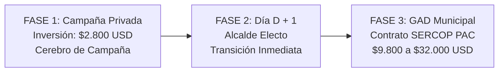

# Estrategia de Campaña Política & Inteligencia Territorial SOLINTEEC

## 1. Visión General & Objetivo Político
La **Plataforma de Escucha Ciudadana y Levantamiento Territorial** constituye la herramienta más disruptiva y estratégica para un candidato a la Alcaldía (ej. Cantón Quijos, Provincia de Napo). 

En lugar de encarar una campaña electoral a ciegas —basada en suposiciones, rumores de comitiva o discursos genéricos que aburren y desconectan al electorado—, el candidato recorre el cantón respaldado por **inteligencia de datos en tiempo real**, conociendo exactamente qué le duele a cada familia, calle y barrio de las 6 parroquias (Baeza, San Francisco de Borja, Papallacta, Cuyuja, Cosanga y Sumaco).

Al triunfar en las urnas, la herramienta no se desecha ni se archiva: **se institucionaliza de inmediato como el portal oficial del GAD Municipal (`plataforma.quijos.gob.ec`)**, asegurando que el nuevo Alcalde inicie su gestión desde el Día 1 con ventaja operativa, legitimidad cívica y sin curvas de aprendizaje.

---

## 2. Campaña Tradicional vs. Campaña Basada en Datos

| Parámetro | Campaña Tradicional (El Error Habitual) | Política Basada en Datos (SOLINTEEC) |
| :--- | :--- | :--- |
| **Discurso de Tarima** | Frases genéricas y promesas abstractas ("apoyaremos a todos"). | Discurso quirúrgico y contundente: datos exactos del barrio visitado. |
| **Diagnóstico Vecinal** | Suposiciones del equipo de campaña; desconexión con la realidad. | Mapa vivo de calor con fotos, coordenadas y reportes reales. |
| **Percepción del Votante** | "Más de lo mismo", político que solo busca el voto. | "Alcalde en funciones": líder técnico que ya está gestionando soluciones. |
| **Uso del Presupuesto** | Gasto masivo en vallas, tarimas y sonido sin base de datos posterior. | Inversión estratégica que deja una red viva de líderes comunitarios. |
| **Día Después de Ganar** | Llega a la Alcaldía a improvisar y ver qué proyectos existen. | Asume el GAD con el inventario de necesidades 100% levantado. |

---

## 3. Tácticas Operativas en Territorio

### Táctica 1: Brigadas Puerta a Puerta (App PWA en Celular)
- Los brigadistas y voluntarios del candidato recorren los caseríos y barrios.
- **Enfoque de escucha cívica**: No piden el voto directamente; levantan la necesidad del vecino: *"Buenas tardes vecina, venimos de parte de la candidatura a registrar el problema de su calle para el Plan Cantonal de Obras Prioritarias"*.
- **Tiempo de registro**: 45 segundos con fotografía georreferenciada.
- **Efecto electoral**: El ciudadano experimenta respeto y atención real, convirtiéndose en simpatizante activo.

### Táctica 2: Códigos QR en Material Físico & Digital
- Incorporación de QR directo en volantes de mano, afiches en comercios amigos, microperforados de la caravana vehicular y campañas en redes sociales (TikTok, Facebook, Instagram).
- **Llamado a la acción**: *"¿Qué necesita tu barrio? Repórtalo aquí y construyamos juntos el Plan de Quijos"*.
- **Efecto electoral**: Conexión directa y masiva con el voto joven y la población urbana descentralizada.

### Táctica 3: War Room del Candidato (Ficha Ejecutiva de Tarima)
- El Cuarto de Guerra monitorea el mapa cantonal en tiempo real.
- Antes de que el candidato descienda del vehículo o suba a la tarima en una parroquia, recibe una **ficha ejecutiva de 1 página** con las 3 prioridades críticas de ese sector.
- **Efecto electoral**: Desarma por completo los discursos vacíos de los contendientes políticos.

---

## 4. Investigación Presupuestaria & Normativa Electoral (CNE)

### Marco Legal: Art. 209 del Código de la Democracia
1. **Fórmula General**: Multiplicación de **$0,40 USD** por el número de ciudadanos empadronados.
2. **Piso Legal para Cantones Menores a 15.000 Empadronados**: La ley establece que el límite no será inferior a **$5.000 USD** de base.
3. **Incremento Regional Amazónico**: Conforme al Código de la Democracia y la Ley Orgánica de la Circunscripción Territorial Especial Amazónica, el techo de gasto electoral privado para dignidades amazónicas se **incrementa en un 30%** sobre el valor calculado.
4. **Techo Legal CNE para Quijos (~6.000 electores)**: Oscila entre **$6.500 USD** (piso legal $5.000 + 30%) y el tramo intermedio de hasta **$20.000 USD** según la resolución formal de techos máximos aprobada por el Pleno del CNE.

### Realidad Financiera de una Campaña a la Alcaldía en Quijos
En la práctica territorial, el presupuesto operativo global de una candidatura competitiva a la Alcaldía de Quijos oscila entre **$15.000 y $30.000 USD** durante los 3 meses de precampaña y campaña formal:

| Rubro de Campaña | Porcentaje Estimado | Rango de Inversión (USD) |
| :--- | :---: | :---: |
| **Movilización, Combustible & Caravanas (6 parroquias)** | 35% | $7.000 – $10.500 |
| **Tarimas, Sonido & Eventos Masivos** | 25% | $5.000 – $7.500 |
| **Brigadistas, Alimentación & Viáticos Comunitarios** | 15% | $3.000 – $4.500 |
| **Material Físico (Banderas, Camisetas, Afiches)** | 15% | $3.000 – $4.500 |
| **Tecnología & Inteligencia Territorial SOLINTEEC** | **10%** | **$2.800** |
| **Total Campaña Competitiva** | **100%** | **$20.800 – $30.000** |

> **Conclusión Económica**: Cobrarle más de $6.000 USD en campaña a un candidato a Alcalde de un cantón pequeño resultaría desproporcionado. Un valor de **$2.800 USD** (o **$950 USD/mes**) representa únicamente el **10%** de su esfuerzo total, convirtiéndose en una inversión sumamente accesible, atractiva y de máxima rentabilidad electoral.

---

## 5. Modelos de Inversión Propuestos para el Candidato

### Opción 1: Paquete Integral de Campaña Electoral
- **Precio**: **$2.800,00 USD** (o 2 cuotas de $1.400).
- **Incluye**:
  - Plataforma Web y App PWA personalizada con los colores, fotografía y mensaje del candidato.
  - Precarga de las 6 parroquias del Cantón Quijos y sus barrios oficiales.
  - Panel móvil y web exclusivo para el Candidato y su Jefe de Campaña.
  - Alojamiento en la nube de alta disponibilidad y soporte técnico permanente hasta el Día D.
  - Reportes ejecutivos para preparación de discursos de tarima.

### Opción 2: Retainer Mensual de Acompañamiento
- **Precio**: **$950,00 USD / mes** (Plan de 3 meses = $2.850 USD).
- **Ventaja**: No descapitaliza el flujo de caja semanal de la campaña.
- **Incluye**:
  - Todos los entregables tecnológicos de la Opción 1.
  - Asesoría semanal de datos: entrega de dossier de prioridades cada lunes para planificar la agenda territorial de la semana.
  - Ajustes continuos de módulos y categorías según el ritmo de la campaña.

---

## 6. Hoja de Ruta de Transición al GAD Municipal (Post-Victoria)

1. **Fase 1: En Campaña (Fondos Privados)**:
   - Se ejecuta sin burocracia ni trámites de SERCOP.
   - Genera la victoria electoral.
2. **Fase 2: Alcalde Electo (Día D + 1)**:
   - El nuevo mandatario institucionaliza la plataforma bajo el dominio municipal oficial (`plataforma.quijos.gob.ec`).
   - Cero curva de aprendizaje: la ciudadanía ya conoce la plataforma y confía en ella.
3. **Fase 3: Contratación Municipal SERCOP**:
   - Una vez posesionado, el GAD contrata formalmente la solución institucional:
     - **Ínfima Cuantía**: Hasta **$10.000,00 USD** (adjudicación directa en 72h conforme al techo legal de contratación pública en Ecuador).
     - **Menor Cuantía / Consultoría**: **$25.000,00 – $32.000,00 USD** con inclusión en el PAC institucional, integrando módulos de Geocercas Viales (COOTAD), Despacho a Direcciones Municipales y Blindaje ante Contraloría.
